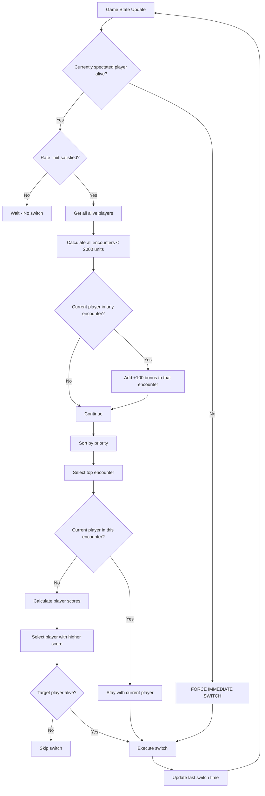

# 🎥 Camera Prioritization System

This document explains how the **Better Auto Observer** intelligently selects which player to spectate based on a sophisticated priority system.

---

## 🎯 Core Concept

The system analyzes all living players and their positions to detect **encounters** (situations where players from opposing teams are close to each other). Each encounter receives a **priority score**, and the camera switches to the player in the highest-priority encounter.

---

## 📊 Priority Calculation

### 1. **Distance-Based Priority** (Most Important!)

Distance is the **primary factor** because it indicates how likely a fight is to happen:

| Distance Range | Priority | Description |
|---------------|----------|-------------|
| **< 300 units** | +150 | 🔴 **Imminent fight!** Close combat, grenades, shotguns |
| **300-600 units** | +120 | 🟠 **High action** Close-range rifles, SMGs |
| **600-1000 units** | +80 | 🟡 **Medium-close** Standard rifle combat |
| **1000-1500 units** | +50 | 🟢 **Medium range** Longer engagements |
| **1500-2000 units** | +20 | 🔵 **Long range** AWP, distant sniping |

> **Note:** Encounters beyond 2000 units are **ignored** as they're too far to result in immediate action.

---

### 2. **Equipment Value**

Players with better weapons create more exciting moments:

```
Priority += Average Equipment Value / 200
```

**Examples:**
- Pistol round ($800 avg) → +4 priority
- Full buy ($9000 avg) → +45 priority
- AWP + full utility ($9000+ avg) → +45+ priority

---

### 3. **Skill Level (Kills)**

Players with more kills tend to create better action:

```
Priority += Average Kills × 3.0
```

**Examples:**
- 0 kills → +0 priority
- 5 kills avg → +15 priority  
- 10 kills avg → +30 priority
- 20 kills avg → +60 priority

---

### 4. **Health Status**

Low HP adds excitement but is weighted carefully (players might die before action):

```
If either player < 50 HP  → +10 priority
If either player < 30 HP  → +10 priority (additional)
```

**Total bonus:** Up to +20 for very low HP encounters

---

### 5. **Defuser Bonus**

CT with defuse kit in encounter:

```
Priority += 20
```

---

## ⭐ Current Player Priority Bonus

**The most important feature:** The system strongly prefers to **stay with the current player** if they're in action.

### How it works:

1. All encounters are calculated normally
2. If the **currently spectated player** is in any encounter:
   ```
   That encounter's priority += 100
   ```
3. After re-sorting, if the current player is still in the top encounter, **stay with them**

### Why this matters:

✅ **Camera stability** - Less random jumping  
✅ **Follow the action** - If you're watching a player in a fight, stay with them  
✅ **Better storytelling** - See kills happen instead of jumping away mid-fight  

### Example:

```
Encounter A: Player1 vs Player2
  Distance: 400 units
  Base Priority: 120 + 25 (equipment) + 15 (kills) = 160

Encounter B: Player3 vs Player4 (currently spectating Player3)
  Distance: 800 units  
  Base Priority: 80 + 30 (equipment) + 20 (kills) = 130
  + Current Player Bonus: +100
  Total Priority: 230 ✅ WINNER

Result: Stay with Player3 even though Encounter A is closer!
```

---

## 🎮 Player Selection Within Encounter

Once the best encounter is identified, the system chooses which player to spectate:

### Priority Order:

1. **If currently spectating one player in this encounter:**
   ```
   → Stay with that player (camera stability)
   ```

2. **Otherwise, calculate player scores:**
   ```
   Score = (Equipment Value / 100) + (Kills × 10) + Health Bonus
   
   Health Bonus:
   - HP > 50 → +5 score
   - HP ≤ 50 → +0 score
   ```

3. **Choose player with higher score**

### Examples:

**Scenario 1: Equal equipment**
- Player A: $5000 equipment, 10 kills, 100 HP
  - Score: 50 + 100 + 5 = **155**
- Player B: $5000 equipment, 3 kills, 80 HP
  - Score: 50 + 30 + 5 = **85**
- **Result:** Spectate Player A (better fragger)

**Scenario 2: Better weapon vs better fragger**
- Player A: $9000 equipment (AWP), 2 kills, 100 HP
  - Score: 90 + 20 + 5 = **115**
- Player B: $4000 equipment (M4), 12 kills, 100 HP
  - Score: 40 + 120 + 5 = **165**
- **Result:** Spectate Player B (hot fragger)

---

## 🛡️ Safety Mechanisms

### 1. **Dead Player Prevention**

Before every switch, verify the target player is still alive:

```go
if target player is DEAD {
    Skip this switch
    Log warning
}
```

### 2. **Dead Player Detection**

Currently spectated player dies:

```go
if currently spectated player not in alive players {
    Bypass rate limiting
    Force immediate switch
    Log: "☠️ Currently spectated player DIED - forcing immediate switch!"
}
```

### 3. **Rate Limiting**

Prevent camera from switching too frequently:

```
Minimum time between switches: 2 seconds (except on player death)
```

**Exception:** When spectated player dies, switch **immediately** (0s delay)

---

## 🔄 Complete Decision Flow



---

## 📈 Example Priority Scenarios

### Scenario 1: Close Combat vs Distant Encounter

**Encounter A:**
- Distance: 250 units (close!)
- Equipment: $4000 avg
- Kills: 5 avg
- HP: Both healthy

```
Priority = 150 (distance) + 20 (equipment) + 15 (kills) = 185
```

**Encounter B:**
- Distance: 1800 units (far)
- Equipment: $9000 avg (AWP duel!)
- Kills: 15 avg  
- HP: Both healthy

```
Priority = 20 (distance) + 45 (equipment) + 45 (kills) = 110
```

**Result:** Spectate **Encounter A** (close combat is more likely to result in kills)

---

### Scenario 2: Current Player Bonus in Action

**Encounter A:**
- Distance: 400 units
- Priority: 165

**Encounter B (contains current player):**
- Distance: 900 units
- Base Priority: 95
- + Current Bonus: +100
- **Total: 195** ✅

**Result:** Stay with current player (camera stability)

---

### Scenario 3: Player Death Override

```
Currently spectating: PlayerX
PlayerX: Just died

Action:
1. Detect PlayerX not in alive players list
2. Log: "☠️ Currently spectated player DIED"
3. BYPASS rate limiting
4. Find best encounter immediately
5. Switch in <100ms
```

---

## 🎛️ Configuration Parameters

Current values in the code:

| Parameter | Value | Purpose |
|-----------|-------|---------|
| `minSwitchInterval` | 2 seconds | Minimum time between normal switches |
| `maxEncounterDistance` | 2000 units | Maximum distance for encounter detection |
| `currentPlayerBonus` | +100 | Priority bonus for current player's encounters |
| `closeRangePriority` | +150 | Bonus for < 300 unit encounters |
| `mediumRangePriority` | +80 | Bonus for 600-1000 unit encounters |

---

## 🔍 Debugging with Verbose Mode

Run with `-v` flag to see detailed priority calculations:

```cmd
better-autoobserver.exe -v
```

**Example output:**

```
[ANALYZER] Found 8 alive players
[ANALYZER] Detected 12 potential encounters
[ANALYZER] ⭐ Current player in encounter: +100 priority (135.5 → 235.5)
[INFO] ⚔️  ENCOUNTER: ShadowSC (T) vs m1337zk3 (CT) | Distance: 450 units | Priority: 235.5
[ANALYZER] ✓ Staying with current player ShadowSC in this encounter
```

---

## 💡 Tips for Best Results

1. **Use in GOTV/Demo mode** - Position data only available there
2. **Keep CS in foreground** - Keyboard simulation requires focus
3. **Run as Administrator** - Improves keyboard input reliability
4. **Watch the logs** - Use `-v` to understand camera decisions

---

## 🚀 Future Improvements

Potential enhancements to the priority system:

- [ ] Detect bomb plant/defuse situations (+200 priority)
- [ ] Detect flashbang/smoke usage (temporary +50 priority)
- [ ] Track recent damage dealt (wounded players more likely to die)
- [ ] Machine learning to predict kill probability from player movements
- [ ] Custom priority profiles (aggressive vs conservative switching)

---

## 📝 Technical Notes

### Position Data Format

CS:GO/CS2 sends position as **string format:**

```json
"position": "-1520.06, 430.89, -63.97"
```

The system parses this into X, Y, Z coordinates for distance calculation using 2D Euclidean distance (ignoring Z for vertical differences).

### Distance Calculation

```go
distance = sqrt((x2-x1)² + (y2-y1)²)
```

Z-coordinate (height) is intentionally ignored to treat multi-level encounters at same priority.

---

## 📚 Related Documentation

- [Main README](../README.md) - Project overview and setup
- [Build Instructions](BUILD.md) - How to compile the project
- [GSI Configuration](../config/gamestate_integration_autoobserver.cfg) - Game State Integration settings

---

<div align="center">

**Made with ❤️ for the CS:GO/CS2 community**

[Report Issue](../../issues) • [Request Feature](../../issues)

</div>
