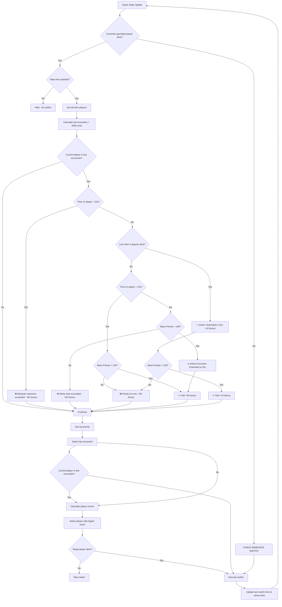

# 🎥 Camera Prioritization System

> **📖 Developer Documentation**  
> Diese Dokumentation erklärt die technischen Details des Camera-Priority-Systems.  
> **Als normaler User musst du das nicht lesen** - das Programm funktioniert automatisch!

This document explains how the **Better Auto Observer** intelligently selects which player to spectate based on a sophisticated priority system.

---

## 🎯 Core Concept

The system analyzes all living players and their positions to detect **encounters** (situations where players from opposing teams are close to each other). Each encounter receives a **priority score**, and the camera switches to the player in the highest-priority encounter.

---

## 📊 Priority Calculation

### 1. **Distance-Based Priority** (Most Important!)

Distance is the **primary factor** because it indicates how likely a fight is to happen:

| Distance Range | Priority | Description |
|---------------|----------|-------------|
| **< 300 units** | +150 | 🔴 **Imminent fight!** Close combat, grenades, shotguns |
| **300-600 units** | +120 | 🟠 **High action** Close-range rifles, SMGs |
| **600-1000 units** | +80 | 🟡 **Medium-close** Standard rifle combat |
| **1000-1500 units** | +50 | 🟢 **Medium range** Longer engagements |
| **1500-2000 units** | +20 | 🔵 **Long range** AWP, distant sniping |

> **Note:** Encounters beyond 2000 units are **ignored** as they're too far to result in immediate action.

---

### 2. **Equipment Value**

Players with better weapons create more exciting moments:

```
Priority += Average Equipment Value / 200
```

**Examples:**
- Pistol round ($800 avg) → +4 priority
- Full buy ($9000 avg) → +45 priority
- AWP + full utility ($9000+ avg) → +45+ priority

---

### 3. **Skill Level (Kills)**

Players with more kills tend to create better action:

```
Priority += Average Kills × 3.0
```

**Examples:**
- 0 kills → +0 priority
- 5 kills avg → +15 priority  
- 10 kills avg → +30 priority
- 20 kills avg → +60 priority

---

### 4. **Health Status**

Low HP adds excitement but is weighted carefully (players might die before action):

```
If either player < 50 HP  → +10 priority
If either player < 30 HP  → +10 priority (additional)
```

**Total bonus:** Up to +20 for very low HP encounters

---

### 5. **Defuser Bonus**

CT with defuse kit in encounter:

```
Priority += 20
```

---

## ⭐ Current Player Priority Bonus (Smart Sticky Camera)

**The most important feature:** The system prefers to **stay with the current player** if they're in meaningful action, but switches away if stuck too long or better action is happening.

### How it works:

1. All encounters are calculated normally
2. If the **currently spectated player** is in an encounter, check conditions:
   - ✅ **Base priority must be >140** (close enough for action)
   - ✅ **Time on current player <15 seconds** (prevent getting stuck)
   
   If both conditions are met:
   ```
   That encounter's priority += 30
   ```
3. After re-sorting, if the current player is still in the top encounter, **stay with them**

### Why these limits matter:

✅ **Camera stability** - Don't jump during active fights  
✅ **Prevents infinite sticking** - Max 15s on one player forces variety  
✅ **Action-focused** - Only bonus for close encounters (<1000 units typically)  
✅ **Balanced** - +30 bonus is enough to prefer current player, but not override much better action  

### Example Scenarios:

**Scenario A: Bonus Applied (Good Action)**
```
Encounter: Player3 vs Player4 (currently spectating Player3)
  Distance: 600 units  
  Base Priority: 120 (distance) + 25 (equipment) = 145
  Time on Player3: 8 seconds
  ✅ Priority >140 AND <15s → +30 Bonus Applied
  Total Priority: 175 ✅ Stay with Player3
```

**Scenario B: No Bonus (Too Long) - BUT Active Encounter Extended Limit**
```
Encounter: Player3 vs Player5
  Base Priority: 155 (close fight!)
  Time on Player3: 18 seconds
  ❌ Exceeded 15s limit BUT...
  ✅ Active encounter (Priority >140) → Extended to 25s!
  Total Priority: 155 + 30 = 185 ✅ Stay with Player3 (fight in progress)
```

**Scenario C: No Bonus (Too Long, Low Priority)**
```
Encounter: Player3 vs Player6
  Base Priority: 50 (far away)
  Time on Player3: 18 seconds
  ❌ Exceeded 15s limit AND Priority <140
  Total Priority: 50 → Switch to better encounter
```

**Scenario D: Clutch Situation Extended Limit**
```
Encounter: Player3 vs Player7
  Distance: 800 units
  Base Priority: 155
  Time on Player3: 20 seconds
  Players alive: 3 (CT: 2, T: 1)
  ✅ Clutch situation (<4 players) → Extended to 25s!
  Total Priority: 155 + 10 = 165 ✅ Stay with Player3 (clutch action)
```

**Scenario E: No Bonus (Too Far)**
```
Encounter: Player3 vs Player6
  Distance: 1800 units  
  Base Priority: 35 (low because far away)
  ❌ Priority <140 → NO bonus
  Total Priority: 35 → Switch to closer action
```

---

## 🎮 Player Selection Within Encounter

Once the best encounter is identified, the system chooses which player to spectate:

### Priority Order:

1. **If currently spectating one player in this encounter:**
   ```
   → Stay with that player (camera stability)
   ```

2. **Otherwise, calculate player scores:**
   ```
   Score = (Equipment Value / 100) + (Kills × 10) + Health Bonus
   
   Health Bonus:
   - HP > 50 → +5 score
   - HP ≤ 50 → +0 score
   ```

3. **Choose player with higher score**

### Examples:

**Scenario 1: Equal equipment**
- Player A: $5000 equipment, 10 kills, 100 HP
  - Score: 50 + 100 + 5 = **155**
- Player B: $5000 equipment, 3 kills, 80 HP
  - Score: 50 + 30 + 5 = **85**
- **Result:** Spectate Player A (better fragger)

**Scenario 2: Better weapon vs better fragger**
- Player A: $9000 equipment (AWP), 2 kills, 100 HP
  - Score: 90 + 20 + 5 = **115**
- Player B: $4000 equipment (M4), 12 kills, 100 HP
  - Score: 40 + 120 + 5 = **165**
- **Result:** Spectate Player B (hot fragger)

---

## 🛡️ Safety Mechanisms

### 1. **Phase-Based Switching** 🆕

The system adapts switching behavior based on the current game phase:

#### 🔄 **Freezetime / Warmup (Buy Phase)**
```
Maximum time per player: 5 seconds
Rate limit: 2 seconds (balanced pacing)
Behavior: Alternates between CT and T teams for variety
```

**Why moderate timing?** During buy phase, there's no action happening. Regular switching (every 5 seconds) keeps viewers engaged by showing:
- Both teams' economy and buys
- Different player perspectives
- Team positioning and strategies

**Team Alternation:** When max time (5s) is reached in freezetime:
1. Try to switch to a player from the **opposite team** (avoiding recently viewed players)
2. If no opposite team player available, switch to any different player
3. This ensures viewers see both CT and T perspectives without repetition

#### ⏸️ **Timeout**
```
Maximum time per player: 10 seconds
Rate limit: 2 seconds
Behavior: Switch between players for variety
```

#### 🎮 **Live Rounds (Normal Game)**
```
Maximum time per player: 15 seconds (base)
Rate limit: 2 seconds
Extended limits:
  - Active encounter (Priority >140): 25 seconds
  - Clutch situation (<4 players): 25 seconds
```

**Why longer?** During live rounds:
- Fights can develop over time
- Players move strategically
- Extended viewing allows watching full engagements

#### ⚡ **Clutch Mode** (<4 Players Alive)
```
Maximum time: 25 seconds (extended)
Rate limit: 1 second (faster)
Bonus: +10 (reduced from +30 to encourage switching)
```

Faster switching ensures all remaining players get camera time in critical moments.

---

### 2. **Dead Player Handling**

**Prevention (Before Switch):**
```go
if target player is DEAD {
    Skip this switch
    Log warning
}
```

**Detection (Current Player Dies):**
```go
if currently spectated player not in alive players {
    Bypass rate limiting
    Force immediate switch
    Log: "☠️ Currently spectated player DIED - forcing immediate switch!"
}
```

### 3. **Rate Limiting (Phase-Adaptive)**

Prevent camera from switching too frequently - adapts to game phase:

```
Freezetime/Warmup: 2 seconds (balanced pacing)
Timeout: 2 seconds
Live/Normal: 2 seconds
Clutch (<4 players): 1 second (faster action)
```

**Exception:** When spectated player dies, switch **immediately** (0s delay)

### 4. **Sticky Time Limit (Phase-Dependent)**

Prevent camera from staying on one player indefinitely - varies by phase:

```
Freezetime/Warmup: 5 seconds maximum (variety with nice pacing)
Timeout: 10 seconds maximum
Normal live rounds: 15 seconds maximum
Clutch/Active encounters: 25 seconds maximum (absolute limit)
```

After the phase-specific time limit, the current player bonus is **removed** or the system forces a switch to a different player.

**Phase-specific behavior:**

- **Freezetime/Warmup:** After 5 seconds, **force switch** to different player (preferably opposite team, avoiding recently viewed)
- **Timeout:** After 10 seconds, force switch for variety
- **Live rounds:** After 15 seconds normal, 25s for active encounters

**EXTENDED TIME LIMITS - Up to 25 seconds in these situations:**

1. **Clutch Situation (< 4 players alive)**
   - When fewer than 4 players are alive, camera can stay up to 25 seconds
   - Reason: Limited action available, but still force switching to see all remaining players
   - Bonus reduced to +10 (instead of +30) to encourage more switching
   - Log: `🎯 Clutch situation (X players alive) - faster switching enabled (1s rate limit, +10 bonus)`

2. **Active Encounter (Priority >140)**
   - When current player is in an active, close-range encounter
   - Extended to 25 seconds to avoid interrupting ongoing fights
   - Log: `🔥 Active encounter detected - extended sticky time limit (25s)`

**Absolute Maximum:** No player can be spectated for more than 25 seconds, regardless of situation.

These limits ensure the camera stays stable during critical moments while still providing coverage of all players:

### 5. **Minimum Priority Threshold for Bonus**

Current player bonus only applied if encounter is worth watching:

```
Base Priority must be > 140
```

This typically means:
- Distance < 1000 units (medium-close range)
- OR very high equipment/skill values

**Why:** No point staying with player in boring, far-away encounter

---

## 🎯 Special Event Systems

The system includes several advanced features that detect and react to special in-game events:

### 1. **🎯 Sniper System**

#### Sniper Duel Detection
When two players with sniper rifles encounter each other:
```
Priority += 100 (Sniper vs Sniper bonus)

If AWP involved:
  Priority += 30 extra (AWP duel bonus)
```

**Why:** Sniper duels are high-stakes, one-shot-kill moments that viewers love to watch.

#### Sniper Kill Tracking
When a player gets a kill with a sniper rifle:
```
AWP Kill:   +200 bonus for 8 seconds
Scout Kill: +150 bonus for 8 seconds
```

**Smart Immediate Switching (AWP kills only):**
- ✅ **AWP kills:** Immediate switch to killer (unless currently watching another sniper)
- ⚠️ **Scout kills:** Uses bonus system instead (no immediate switch to avoid excessive jumping)
- ❌ **No switch if:** Current player has AWP/Sniper (don't interrupt sniper action)

**Weapon Differentiation:**
- AWP gets higher priority than Scout in all calculations
- Player selection bonus: AWP +30, Scout +15

### 2. **💥 Damage Detection System**

Tracks health changes to detect damage dealers and switch to action:

#### How It Works:
1. **Health Tracking:** Monitors HP of all players every tick
2. **Damage Detection:** Triggers when player loses >20 HP
3. **Attacker Identification:**
   - Finds nearest enemy with shooting weapon
   - Range limits:
     - Normal weapons: max 1500 units
     - Sniper rifles: max 3000 units
   - Excludes grenades, molotovs, knives

#### Immediate Switching:
```
When damage detected:
  → Immediate switch to damage dealer
  → +40 bonus for 5 seconds
```

**Filtering:**
- ✅ Guns, rifles, SMGs, pistols
- ❌ Grenades, molotovs, incendiaries, knives, C4, tasers

**Why:** Catching the moment someone lands shots creates dynamic, action-packed spectating.

### 3. **🏆 Upset Victory System**

Detects when an underdog wins a fight and prioritizes showing the victor:

#### Detection:
```
If player NOT currently spectated wins an encounter:
  → Upset victory!
  → +100 bonus for 10 seconds
  → Immediate switch to winner
```

**Requirements:**
- Last encounter must have had 2 players
- One player died (killed)
- Winner is NOT the player we were watching

**Why:** Viewers want to see the winner's perspective, especially if we missed their winning moment.

### 4. **Priority Override Scenarios**

These situations **bypass normal rate limiting** for immediate switches:

1. **Player Death** ☠️
   - Currently spectated player dies
   - Switch immediately (0s delay)

2. **Upset Victory** 🏆
   - Underdog wins encounter
   - Switch immediately to winner

3. **AWP Kill** 🎯
   - Player gets AWP kill
   - Switch immediately (unless watching another sniper)

4. **Damage Dealt** 💥
   - Player lands 20+ damage
   - Switch immediately to shooter

---

## 🔄 Complete Decision Flow



---

## 📈 Example Priority Scenarios

### Scenario 1: Close Combat vs Distant Encounter

**Encounter A:**
- Distance: 250 units (close!)
- Equipment: $4000 avg
- Kills: 5 avg
- HP: Both healthy

```
Priority = 150 (distance) + 20 (equipment) + 15 (kills) = 185
```

**Encounter B:**
- Distance: 1800 units (far)
- Equipment: $9000 avg (AWP duel!)
- Kills: 15 avg  
- HP: Both healthy

```
Priority = 20 (distance) + 45 (equipment) + 45 (kills) = 110
```

**Result:** Spectate **Encounter A** (close combat is more likely to result in kills)

---

### Scenario 2: Current Player Bonus in Action

**Encounter A:**
- Distance: 400 units
- Priority: 165

**Encounter B (contains current player):**
- Distance: 900 units
- Base Priority: 95
- + Current Bonus: +100
- **Total: 195** ✅

**Result:** Stay with current player (camera stability)

---

### Scenario 3: Player Death Override

```
Currently spectating: PlayerX
PlayerX: Just died

Action:
1. Detect PlayerX not in alive players list
2. Log: "☠️ Currently spectated player DIED"
3. BYPASS rate limiting
4. Find best encounter immediately
5. Switch in <100ms
```

---

## 🎛️ Configuration Parameters

Current values in the code:

| Parameter | Value | Purpose |
|-----------|-------|---------|
| **Phase-Based Times** | | |
| Freezetime/Warmup max time | 5 seconds | Regular switching in buy phase |
| Freezetime/Warmup rate limit | 2 seconds | Balanced pacing for viewers |
| Timeout max time | 10 seconds | Moderate switching during timeout |
| Timeout rate limit | 2 seconds | Normal rate limiting |
| Live rounds max time | 15 seconds | Allow encounter development |
| Live rate limit | 2 seconds | Prevent excessive switching |
| Clutch rate limit | 1 second | Faster switching in critical moments |
| Extended max time | 25 seconds | Active fights & clutch (absolute max) |
| **Priority Values** | | |
| `maxEncounterDistance` | 2000 units | Maximum distance for encounter detection |
| `currentPlayerBonus` | +30 | Priority bonus for current player's encounters |
| `currentPlayerBonusClutch` | +10 | Reduced bonus in clutch for more switching |
| **Special Event Bonuses** | | |
| `sniperDuelBonus` | +100 | Sniper vs Sniper encounter |
| `awpDuelBonus` | +30 | Additional bonus when AWP involved |
| `awpKillBonus` | +200 (8s) | AWP kill immediate priority |
| `scoutKillBonus` | +150 (8s) | Scout kill priority |
| `damageDealtBonus` | +40 (5s) | Landing 20+ HP damage |
| `upsetVictoryBonus` | +100 (10s) | Underdog wins encounter |
| `awpWeaponBonus` | +30 | Player selection bonus (AWP) |
| `scoutWeaponBonus` | +15 | Player selection bonus (Scout) |

---

## 🔍 Debugging with Verbose Mode

Run with `-v` flag to see detailed priority calculations:

```cmd
cs2-better-autodirector.exe -v
```

**Example output:**

```
[ANALYZER] Found 8 alive players
[ANALYZER] Detected 12 potential encounters
[ANALYZER] ⭐ Current player in encounter: +100 priority (135.5 → 235.5)
[INFO] ⚔️  ENCOUNTER: ShadowSC (T) vs m1337zk3 (CT) | Distance: 450 units | Priority: 235.5
[ANALYZER] ✓ Staying with current player ShadowSC in this encounter
```

---

## 💡 Tips for Best Results

1. **Use in GOTV/Demo mode** - Position data only available there
2. **Keep CS in foreground** - Keyboard simulation requires focus
3. **Run as Administrator** - Improves keyboard input reliability
4. **Watch the logs** - Use `-v` to understand camera decisions

---

## 🚀 Future Improvements

Potential enhancements to the priority system:

- [ ] Detect bomb plant/defuse situations (+200 priority)
- [ ] Detect flashbang/smoke usage (temporary +50 priority)
- [ ] Machine learning to predict kill probability from player movements
- [ ] Custom priority profiles (aggressive vs conservative switching)
- [ ] Grenade trajectory tracking for better grenade damage detection

**Already Implemented ✅:**
- [x] Track recent damage dealt (wounded players more likely to die) → **Damage Detection System**
- [x] Sniper duel prioritization → **Sniper System**
- [x] Upset victory detection → **Upset Victory System**
- [x] Kill tracking and immediate switching → **Sniper Kill Tracking**

---

## 📝 Technical Notes

### Position Data Format

CS2 sends position as **string format:**

```json
"position": "-1520.06, 430.89, -63.97"
```

The system parses this into X, Y, Z coordinates for distance calculation using 2D Euclidean distance (ignoring Z for vertical differences).

### Distance Calculation

```go
distance = sqrt((x2-x1)² + (y2-y1)²)
```

Z-coordinate (height) is intentionally ignored to treat multi-level encounters at same priority.

---

## 📚 Related Documentation

- [Main README](../README.md) - Project overview and setup
- [Build Instructions](BUILD.md) - How to compile the project
- [GSI Configuration](../config/gamestate_integration_autodirector.cfg) - Game State Integration settings

---

<div align="center">

**Made with ❤️ for the CS2 community**

[Report Issue](../../issues) • [Request Feature](../../issues)

</div>
